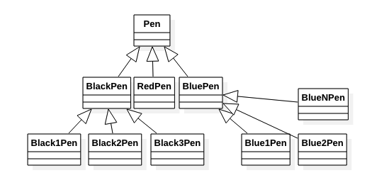
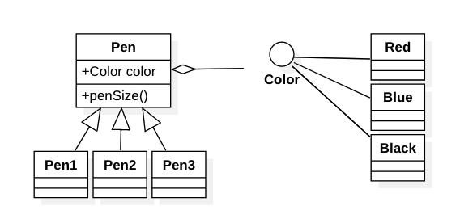

# 桥接模式

当一个系统中某个类存在一个或者多个独立变化的维度（比如：构建一个笔对象，他关系的维度有颜色和笔粗细度）。愚蠢的做法是针对这些可能的组合构建出所有可能的类。比如N种颜色M种笔号。那么系统中就N*M个实现类以及中间的父级继承类。



而我们使用桥接模式就可以将这些多个变化的维度全部解耦出来，通过组合的方式来进行拼装，而不是走继承的方式。这维度和维度之间的联系组合我们把它称为桥。如下图Color和Pen之间就是一座桥，这个桥所连接是两个继承体系。两个继承体系独立变化。



**必要条件**

- 抽象类： 将原来的那个设计多维度的变化的对象。这个抽象类主要担当接口的作用！用来多态其实现类的。
- 抽象类的扩充：也可以理解为抽象类的具体实现类。他相当于就完成各种变化的最终组合的实现类，组合方式就是调用桥的另一个组合对象来动态完成组合的。我们可以将其中一种变化放入到该抽象类实现中去。比如上面Pen的大小。这样Pen内部通过多态的Color来组合不同的情况。
- 实现类接口：定义实现类的接口，是桥的另一端的继承体系的祖宗。只封装一个变化。
- 实现类的具体实现类：就是该维度变化的各种情况的实现。

**类图**


**实现**

```java
/**
 * 抽象类
 */
abstract class Pen {
    Color color;

    public void setColor(Color color) {
        this.color = color;
    }

    abstract void size();
}

/**
 * 某个变化维度的接口
 */
interface Color {
    void color();
}

/**
 * 变化维度接口的实现
 */
class Red implements Color {
    @Override
    public void color() {
        System.out.println("red");
    }
}

class Black implements Color {
    @Override
    public void color() {
        System.out.println("black");
    }
}

class Blue implements Color {
    @Override
    public void color() {
        System.out.println("blue");
    }
}

/**
 * 抽象类的具体实现
 */
class Pen1 extends Pen {
    @Override
    void size() {
        color.color();
        System.out.println("size:1");
    }
}

class Pen2 extends Pen {
    @Override
    void size() {
        color.color();
        System.out.println("size:2");
    }
}
```

使用

```java
Pen p = new Pen1();
Color c = new Red();
p.setColor(c);
p.size();
```

## 桥接模式和适配器模式连用

桥接模式是设计初期的，适配器模式是可能开发中期的。他们位于系统设计的不同阶段。当我们发现现有的类和我们正在开发的系统无法协同工作就可以使用适配器模式。而所适配的可能就是桥接的某个维度接口的某个功能实现。比如：一个系统的数据采集可以有文本，csv，数据库，我们有现成的数据库的连接库，这时候就要一个适配器来适配这个库，并实现数据采集的接口来实现桥接。

## 总结

桥接是设计Java虚拟机和是实现JDBC等驱动程序的核心模块之一。**具体待举例**